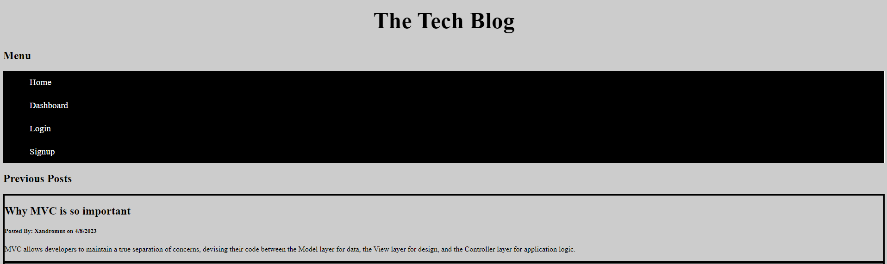

# tech-blog
  by allstarcoding777
  
  * ## Description
  This application is a blog site where developers can publish their blog posts and comment on other developers’ posts as well. 
  * ## Usage
  When a user loads the page they are presented with existing blog posts and can click on the navigation links to signup, login, view their dashboard, or return to the home page.
  
  

  * ## Deployed Application
  https://tech-blog-777.herokuapp.com/
  
  * ## License
  This project is licensed under the MIT license.